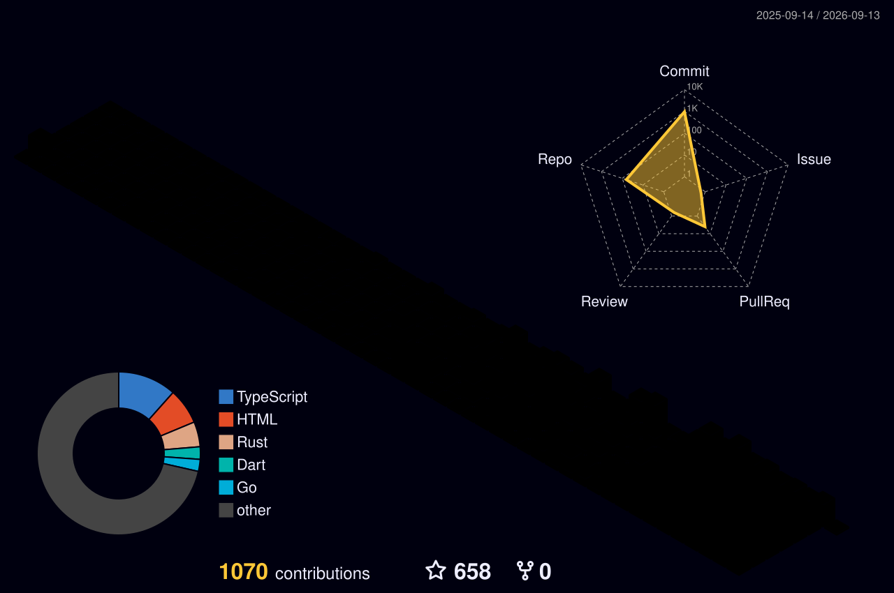
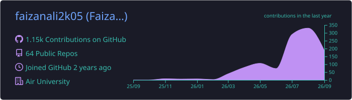
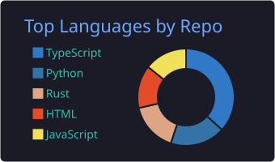
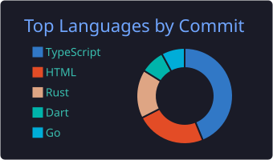
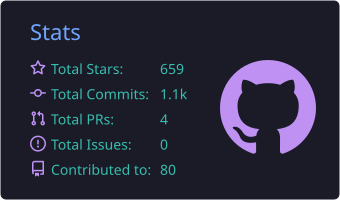

<!--
  ============================================================
  FAIZAN ALI · GitHub Profile README
  Theme: Blue & Black · No emojis · Real icons only
  ============================================================
-->

<!-- ================= ANIMATED HERO ================= -->

  

<!-- ================= LOCATION + STATUS LINE ================= -->

  
  
  
  

<!-- ================= CONNECT (REAL PLATFORM ICONS) ================= -->

  
  
  
  
  
  
  

---

<!-- ================= ABOUT (ANIMATED IDENTITY CARD) ================= -->

  

  

---

<!-- ================= TECH STACK (CATEGORIZED, REAL ICONS) ================= -->

  

<table align="center" width="100%">
  <tr>
    <td align="right" width="22%">
      
    </td>
    <td align="left">
      
    </td>
  </tr>
  <tr>
    <td align="right">
      
    </td>
    <td align="left">
      
    </td>
  </tr>
  <tr>
    <td align="right">
      
    </td>
    <td align="left">
      
    </td>
  </tr>
  <tr>
    <td align="right">
      
    </td>
    <td align="left">
      
    </td>
  </tr>
  <tr>
    <td align="right">
      
    </td>
    <td align="left">
      
      
      
    </td>
  </tr>
  <tr>
    <td align="right">
      
    </td>
    <td align="left">
      
    </td>
  </tr>
</table>

---

<!-- ================= CURRENTLY BUILDING ================= -->

  

  

<table align="center" width="100%">
  <tr>
    <td align="center" width="50%">
      
      

         
        Decentralized multi-agent AI coordination layer combining LLM-based agent swarms with on-chain consensus and verifiable execution.
      

      

        
        
        
        
        
      

    </td>
    <td align="center" width="50%">
      
      

         
        Web3-enabled remittance app lowering fees on Pakistan-bound transfers via stablecoin settlement rails.
      

      

        
        
        
        
        
      

    </td>
  </tr>
</table>

  

---

<!-- ================= EXPERIENCE TIMELINE ================= -->

  

<table align="center" width="100%">
  <tr>
    <td align="center" width="50%">
      
      <h4>Software Developer · 5Kassi</h4>
      

        Led end-to-end development of high-performance web platforms and marketing automation tools at a top-3 Multan agency. Built React frontends with Python (FastAPI / Django) backends serving live client campaigns. Owned deployment, CI/CD, and monitoring on GCP.
      

    </td>
    <td align="center" width="50%">
      
      <h4>Software Manager · Magsi Traders</h4>
      

        Business partnership managing software systems for an export-focused agribusiness. Designed internal tooling for trade workflow tracking, vendor coordination, and order management. Owned digital presence and external integrations.
      

    </td>
  </tr>
</table>

---

<!-- ================= GITHUB ANALYTICS ================= -->

  

  
  

  
  

---

<!-- ================= ACTIVITY GRAPH ================= -->

  

  

---

<!-- ================= 3D CONTRIBUTIONS (workflow-generated) ================= -->

  

  

---

<!-- ================= SNAKE ANIMATION (UNCHANGED) ================= -->

  

  

---

<!-- ================= PROFILE SUMMARY CARDS ================= -->

  

  

  
  
  

---

<!-- ================= TROPHIES ================= -->

  

  

---

<!-- ================= CREDENTIALS ================= -->

  

  
  
  

  
  
  
  

---

<!-- ================= QUOTE ================= -->

  

---

<!-- ================= VISITOR COUNTER ================= -->

  
  
  

---

<!-- ================= ANIMATED FOOTER ================= -->

  

